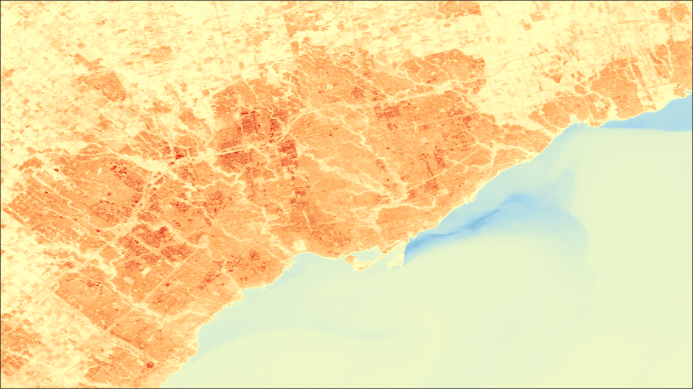

# Toronto Urban Heat Island Vulnerability Analysis
**Explore the interactive results:** [Heat Vulnerability in Toronto StoryMap](https://storymaps.com/stories/ac363812a8e146f6b4d61aea3fd55a83)

## Overview
This project analyzes Toronto's urban heat islands (UHIs) using remote sensing and geospatial techniques. By assessing land surface temperatures and overlaying demographic data, it identifies neighbourhoods most affected by UHIs and highlights areas with vulnerable populations.

The urban heat island effect is a when a local area has a significantly higher temperature due to several factors in the immediate environment, including nearby water, nearby vegetation, and more. Extreme heat is the largest weather related killer, and can exacerbate cardiovascular conditions. Several social and demographic factors can put some people at higher risk of heat related negative health outcomes.

## Tools & Tech & Skills
- QGIS, Landsat 8 Imagery, Raster Calculation, Spectral Band Analysis

## Methodology
This analysis identified **Urban Heat Islands** in Toronto by leveraging remote sensing and geospatial techniques in **QGIS**.
**1. Data Acquisition**
- ***Satellite imagery:*** Acquire from Landsat 8, Collection 2 imagery, dated August 22, 2024
- ***Demographic data:*** Sourced from the 2021 Canadian Census, accessed via the City of Toronto Open Data Portal

**2. Heat Island Raster Analysis**
- ***Clipping & Reprojection:*** Aligned data sets to common CRS.
- ***Surface Temperature Estimation:*** Extracted Land Surface Temperature (LST) using spectral band data by first calculating TOA radiance, brightness temperature, NDVI, fractional vegetation cover, and emissivity (More info in StoryMaps).
- ***Zonal Statistics:*** Identified high temperatures neighbourhoods by applying zonal statistics on land surface temperature raster.

**3. Demographic Overlay**
- ***Demographic Factor Mapping:*** Mapped several heat sensitivity factors to Toronto neighbourhoods including age, income, housing suitability, immigration status and outdoor commuting.
- ***Heat Sensitivity Mapping:*** Computed overall heat sensitivity and combined with LST to create map of most vulnerable areas.

**4. Visualization & Insights**
- ***Thematic Mapping in QGIS:*** Designed heat maps with custom symbology to highlight critical UHI areas and demographic sensitivity.
- ***StoryMap Narrative:*** Findings were presented using [StoryMaps](https://storymaps.com/stories/ac363812a8e146f6b4d61aea3fd55a83) to contextualize results with real-world impacts.

## Results
Neighbourhoods with **highest average surface temperature** are:

    Humber Summit
    Junction-Wallace Emerson
    Weston-Pelham Park
    Dovercourt Village
    Briar Hill-Belgravia

Neighbourhoods with **highest average heat vulnerability** are:

    Thorncliffe Park
    North St. James Town
    Kensington-Chinatown
    Bay-Cloverhill
    Yonge-Bay Corridor

 ***Land Surface Temperature(LST)** in the GTA (from Landsat 8 imagery taken August 13, 2024)* 
 ***Overall Heat Sensitivity** in the GRA based on several demographic factors*
 ***Overall Heat Vulnerability** in the GTA based on LST and demographic factors*

## Data Sources
- Remote Imagery - Landsat 8, Collection 2, USGS, [Earth Explorer](https://earthexplorer.usgs.gov/)
- Neighbourhood Boundary - Toronto Open Data, [Neighbourhood Boundaries Dataset](https://open.toronto.ca/dataset/neighbourhoods/)
- Neighbourhood Demographics - Toronto Open Data, [Neighbourhood Profiles Dataset (2021)](https://open.toronto.ca/dataset/neighbourhood-profiles/)