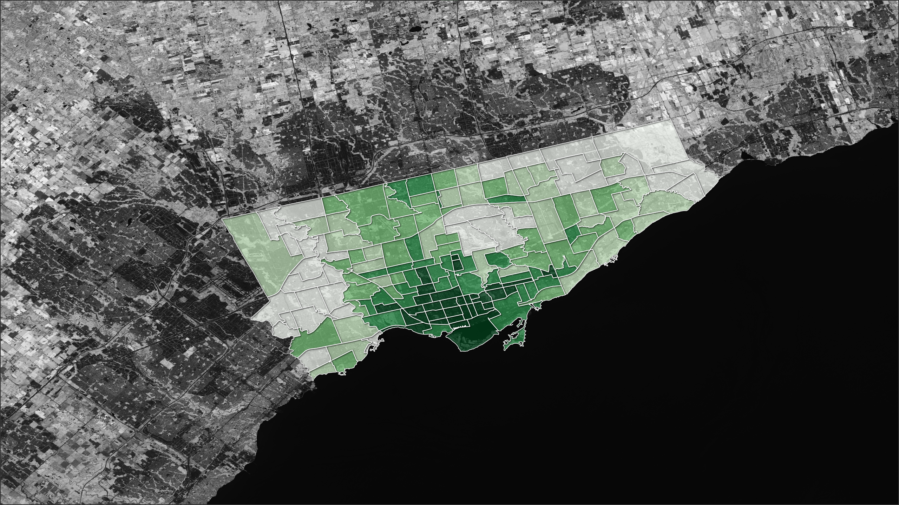

# Toronto Urban Heat Island Vulnerability Analysis
[Read the results on StoryMaps](https://storymaps.com/stories/ac363812a8e146f6b4d61aea3fd55a83)

## Overview
The objective of this project was to use raster analysis of remote sensor imagery to measure which neighbourhoods of Toronto, Canada experience the worst "Urban Heat Islands" and to combine that with census data to determine which neighbourhoods experience the worst "Heat Vulnerability."

The urban heat island effect is a when a local area has a significantly higher temperature due to several factors in the immediate environment, including nearby water, nearby vegetation, the reflectivity of the nearby surfaces, and more. It can be measured by calculating the local surface temperature of the Earth, which can be done from satellite imagery.

Extreme heat is the largest weather related killer, and can exacerbate cardiovascular conditions. Several social and demographic factors can put some people at higher risk of heat related negative health outcomes.

Heat Vulnerability is a measure that combines local urban heat islands and demographic factors to determine which areas are at greatest overall risk of heat related negative health outcomes. It is not a universal measure.

## Results & Key Takeaways
Neighbourhoods with **highest average surface temperature** are:

    Humber Summit
    Junction-Wallace Emerson
    Weston-Pelham Park
    Dovercourt Village
    Briar Hill-Belgravia
    Corso Italia-Davenport
    Yorkdale-Glen Park
    Oakwood Village
    Palmerston-Little Italy
    Trinity-Bellwoods

Neighbourhoods with **highest average heat vulnerability** are:

    Thorncliffe Park
    North St. James Town
    Kensington-Chinatown
    Bay-Cloverhill
    Yonge-Bay Corridor
    Church-Wellesley
    Yonge-Doris
    Newtonbrook West
    York University Heights
    Black Creek
 ***Land Surface Temperature(LST)** in the GTA (from Landsat 8 imagery taken August 13, 2024)*  ***Overall Heat Vulnerability** in the GTA based on LST and demographic factors*

## Process
The ultimate goal was to combine Land Surface Temperature (to represent heat islands) and Heat Sensitivity (a combination of demographic factors). To do this, land surface temperature needed to be calculated information in the Landsat 8 imagery, and numerous demographic factors needed to be normalized.

### Finding the Land Surface Temperature
The land surface temperature required performing some raster calculations.
#### Top of Atmosphere Spectral Radiance
First, the digital number (DN) observed by the sensor needed to be scaled to represent the amount of radiation (emitted, reflected and scattered) at the top of the atmosphere reaching the sensor. This just involves using sensor multiplicative and additive values found in the imagery's metadata.

#### Brightness Temperature
Then, the brightness temperature is derived from the TOA radiance using the sensor's thermal imaging band using the sensor's specific calibration parameters.

#### Fractional Vegetation Cover & Normalized Difference Vegetation Index
Fractional vegetation cover reflects the density of vegetation within a region. It is derived from Normalized Difference Vegetation Index (NDVI), which is a measure that estimates the vegetation of a region of a remote image based on the difference in reflectance observed in healthy plants between the red wavelengths and near-infrared wavelengths of light.

#### Emissivity
Emissivity is a measure of a surface's efficiency in emitting thermal radiation. It depends on the qualities of the surface, and dense vegetation tends to have higher emissivity. The measure is based on fractional vegetation cover.

#### Land Surface Temperature
Finally, with the above factors calculated, the land surface temperature could be determined. 
(Final LST result shown in the results section above).

### Processing Demographic Data
There is not a universal definition for heat sensitivity. This analysis used several factors found in census data, but there are absolutely other factors that can affect one's sensitivity to extreme heat related health outcomes.

The factors included in this analysis were:
1. **Age** - Percentage of residents over 65 years of age
2. **Income** - Percentage of residents with 'Low Income Measure After Tax (LIM-AT)' status
3. **Housing Suitability** - Percentage of residents in housing with insufficient bedrooms for the number housed
4. **Immigration** - Percentage of immigrants or non-permanent residents (due to marginalization, these groups often have worse access to healthcare and other sensitivity affecting factors)
5. **Outdoor Commute** - Percentage of residents who do not commute by private automobile

Here are the maps representing these factors, in the order listed above.

When normalized and averaged, this created a 'heat sensitivity' map of neighbourhoods.

## Conclusion
With the land surface temperature and heat sensitivity calculated, the last steps were to use zonal statistics to average LST by neighbourhood and combine. The result was a map of heat vulnerability in Toronto. 

To read the full story, check out the article written for this project on [StoryMaps](https://storymaps.com/stories/ac363812a8e146f6b4d61aea3fd55a83).

**Going Further**
This analysis only used remote sensing imagery from one day - a more complete analysis would incorporate imagery from months or years to better average out the typical locations of urban heat islands and observe the change in heat islands over time. 

## Attribution
**Tools Used**
- QGIS
- USGS Earth Explorer
- StoryMaps

**Data Used**
- Remote Imagery - Landsat 8, Collection 2, USGS, [Earth Explorer](https://earthexplorer.usgs.gov/)
- Neighbourhood Boundary - Toronto Open Data, [Neighbourhood Boundaries Dataset](https://open.toronto.ca/dataset/neighbourhoods/)
- Neighbourhood Demographics - Toronto Open Data, [Neighbourhood Profiles Dataset (2021)](https://open.toronto.ca/dataset/neighbourhood-profiles/)